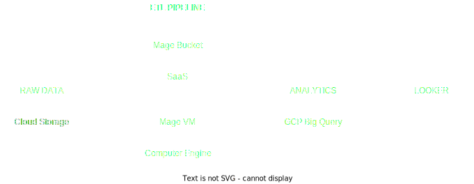

# PROJETO FINAL SISTEMAS DISTRIBUIDOS

###  <center> **Definição do sistema** </center>

<u>Conceitos Envolvidos:</u>
- Envio de dados utilizando Sockets TCP e Datagrama UDP
- Protocolo Requisição/Resposta. Especificação e implementação realizada por vocês
- Representação externa de dados. JSON e Protocol Buffers
- Comunicação por filas
  
<u>Arquitetura:</u>



<u>Requisitos Não-Funcionais:</u>

**[ ]** Privacidade

**[ ]** Confiabilidade

**[ x ]** Escalabilidade: implementações da GCP

----
## <center> **Como Executar este Projeto** </center>

1. Crie uma rede no Docker
```sh
docker network create pg-network
```
2. Construa a imagem do docker
```sh
docker build -t <container_name> .
```
3. Execute a imagem
```sh
docker run -it --network=pg-network data_ingest:v001 --u=root --pw=root --h=local/host --p=5432 --db=ny_taxi --t=yellow_taxi_data --U={url}
```
