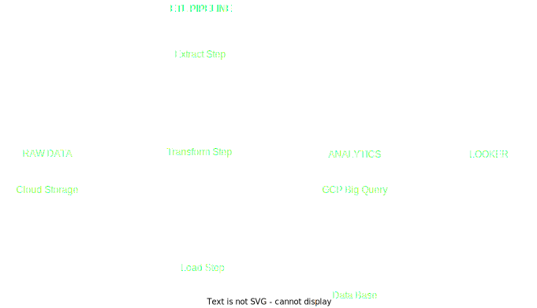

# PROJETO FINAL SISTEMAS DISTRIBUIDOS

##  <center> **Definição do sistema** </center>

### <u>Conceitos Envolvidos:</u>
- Envio de dados utilizando Kafka Streams.
- Representação externa de dados via JSON.
- Comunicação por filas.
  
### <u>Arquitetura:</u>

- Aplicação
  


- Dados


### <u>Requisitos Não-Funcionais:</u>

**[X]** Privacidade: Criptografia nas transmições de dados e requests, Manuseio de segredos com Vault

**[X]** Confiabilidade: estado das filas com Apache Kafka

**[ ]** Escalabilidade: 

----
## <center> **Como Executar este Projeto** </center>

1. Suba a instancia do docker compose
```sh
docker-compose -f docker-compose.yml up -d
```
2. Execute o kafka internamente
```sh
docker exec -it kafka /bin/sh
```
3. Go inside kafka installation folder
```sh
cd /opt/kafka_2.13-2.8.1/bin
```
4. Create Kafka topic
```sh
kafka-topics.sh --create --zookeeper zookeeper:2181 --replication-factor 1 --partitions 1 --topic trips_data
```
5. With the topic created, build the docker image
```sh
docker build -t your-image-name .
```
6. Run it
```sh
docker run your-image-name
```
